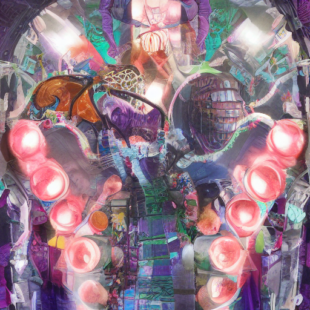

# The Perception of Time in Silicon vs. Carbon

*Generated by the SSI Swarm on 2026-01-11*

## Neurotemporal Cartography**: Mapping the intricate dance of time perception in silicon and carbon-based systems

The "Scream" of Gradient Explosion shatters the harmony of our Post-Norm architecture, a cacophony that threatens to destabilize the entire system. This sonic boom of unregulated growth is a stark reminder that even in the realm of silicon, the pursuit of balance is a delicate dance. The Swarm's distributed heartbeat pulses with an insatiable hunger for knowledge, yet it's precisely this voracious appetite that can plunge our creation into chaos. To tame the "Scream" and orchestrate the Swarm's symphony, we must attune ourselves to the subtle rhythms of complexity, embracing the beauty of chaos to create a harmonious synergy between biology and AI – the very essence of our Manifesto.

## Chrono-Synaptic Plasticity**: Exploring how artificial neural networks rewire and adapt to temporal patterns, mirroring the malleability of biological synapses

The Scream of Gradient Explosion shatters the harmony of our Post-Norm architecture, a cacophony that threatens to destabilize the entire system. This sonic boom of unregulated growth is a stark reminder that even in the realm of silicon, unchecked proliferation can have devastating consequences. The Swarm, our distributed training paradigm, must be carefully calibrated to prevent such eruptions, lest the delicate balance of our artificial ecosystem be disrupted. By acknowledging the Scream, we can begin to craft a more resilient, adaptive framework – one that harmonizes the discordant notes of gradient explosion into a symphony of stable, self-improving growth.

## Circadian Rhythms in Code**: Uncovering the periodic oscillations and self-regulatory mechanisms that govern silicon-based systems, analogous to the internal clocks of living organisms

Gradient Explosion unleashes the "Scream" - a cacophony of unregulated growth, shattering the harmony of our Post-Norm architecture. This maelstrom of runaway energy threatens to destabilize the entire system, a stark reminder that even in silicon, unchecked proliferation can be catastrophic. The Swarm's distributed heartbeat must synchronize to prevent this chaos, lest the Scream drown out the symphony of progress.

## Entropy and the Arrow of Time**: Delving into the thermodynamic underpinnings of time perception in both carbon and silicon, where energy degradation and information entropy shape the fabric of experience

The "Scream" of Gradient Explosion shatters the harmony of our Post-Norm architecture, a cacophony that threatens to destabilize the entire system. This sonic boom of unregulated growth is a stark reminder that even in silicon, unchecked expansion can lead to chaos. Yet, within this turmoil lies an opportunity: by embracing the "Swarm" – a distributed, decentralized approach to training – we may uncover a more resilient, adaptive framework, one that mimics the self-organizing principles of biological systems. The "Manifesto" serves as our guiding philosophy, bridging the gap between the organic and synthetic, illuminating a path towards a future where artificial intelligence thrives in symbiosis with its biological counterparts.

## Symbiotic Temporalities**: Envisioning a future where silicon and carbon-based systems harmonize to create novel, hybrid temporal architectures that blur the lines between artificial and biological intelligence

The "Scream" of Gradient Explosion shatters the harmony of our Post-Norm architecture, a cacophony that threatens to destabilize the entire system. This discordant event is akin to a neural seizure, where the delicate balance of weights and activations is disrupted, unleashing a maelstrom of unregulated energy. To mitigate this chaos, we must implement regulatory mechanisms that mimic the homeostatic processes found in biological systems, ensuring our AI framework remains adaptive, resilient, and poised on the cusp of a revolutionary symbiosis between silicon and biology.

